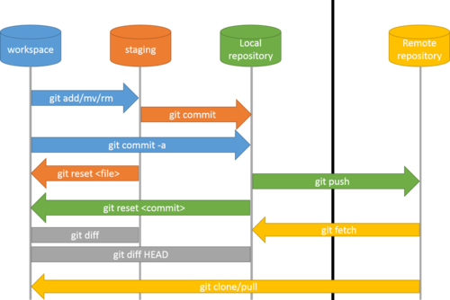
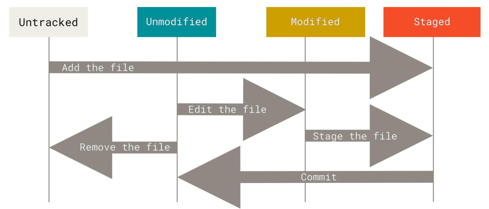

# Git基础



 - Workspace：工作区
 - Index / Stage：暂存区
 - Repository：仓库区（或本地仓库）
 - Remote：远程仓库

## 获取Git仓库 (skip)

```
git init
git add .
git commit -m "<SOME MSG>"
git status
```

## 纪录每次更新到仓库 (skip)

- 请记住，你工作目录下的每一个文件都不外乎这两种状态:已跟踪 或 未跟踪。 



**忽略文件**
 - .gitignore

**查看已暂存和未暂存的修改**
 - `git diff`   
   - 更仔细看查看尚未暂存的文件更新
   - workspace vs index/stage changes

 - `git diff --staged` 或 `git diff --cached`
   - index/stage vs local repo changes

**移除文件（git rm）**
 - `git rm <file>`
   - 将文件从暂存区和工作区中删除

 - `rm <file>`
   - 只将文件从工作区中删除（不会从暂存区删除）

 - `git rm --cached <file>`
   - 只将文件从暂存区域移除（不会从工作区中删除）

 - `git rm -f <file>`
   - 如果删除之前修改过并且已经放到暂存区域的话，则必须要用强制删除选项 -f

**移动文件**

 - 改名可以用`git mv file_from file_to`
   - 这也相当于：
```
mv file_from file_to
git rm file_from
git add file_to
```

## 查看提交历史 (skip)
 - `git log`
 - (skip)

## 撤销操作

 - commit后才发现漏了几个文件，怎么办？可以用 `git commit --amend`
   - 这个命令会将暂存区(index/stage) 中的文件提交。 
   - 例如，你提交后发现忘记了暂存某些需要的修改，可以像下面这样操作:
```
$ git commit -m 'initial commit' 
$ git add forgotten_file
$ git commit --amend
```

 - git add后想取消暂存区(stage)的，怎么办？可以用`git reset HEAD <file>`
   - 作出的修改仍然保存着
   - stage -> workspace

 - 如何将某个文件还原成上次提交的样子？可以用`git checkout -- <file>`

## 远程仓库的使用 (skip)
 - `git clone <url>`
 - `git remote -v`
   - 显示需要读写远程仓库使用的 Git 保存的简写与其对应的 URL。
 - (skip)

**从远程仓库中抓取与拉取**
 - `git fetch <remote>`
   - 访问远程仓库，从中拉取所有你还没有的数据。 执行完成后，你将会拥有那个远程仓库中所有分支 的引用，可以随时合并或查看。
   - 必须注意git fetch命令只会 将数据下载到你的本地仓库——它并不会自动合并或修改你当前的工作。
 - (SKIP)

## 打标签

 - Git 支持两种标签: 轻量标签(lightweight)与附注标签(annotated)。
   - 轻量标签很**像一个不会改变的分支**
     - 它只是某个特定提交的引用。
   - 附注标签是存储在 Git 数据库中的一个**完整对象**，
     - 它们是可以被校验的，其中包含打标签者的名字、电子邮件 地址、日期时间， 此外还有一个标签信息，并且可以使用 GNU Privacy Guard (GPG)签名并验证。 
     - 通常会建议创建附注标签，这样你可以拥有以上所有信息。

**附注标签**

 - `git tag -a <tag_name> -m "<tag_description>"`：创造标签并与最近的提交连接
   - 如果不使用`-m`，Git 会启动编辑器要求你输入信息。

**轻量标签**
 - `git tag <tag_name>`：只储存tag名字；没其他消息

**其他**
 - `git tag`：显示所有标签
 - `git tag -l "v1.8.*"`：显示所有符合v1.8.开头的标签
 - `git show <tag_name>`：显示标签者的信息、打标签的日期时间、附注信息，然后显示具体的提交信息。

**后期打标签**
 - `git tag -a <tag_name> <提交编号>`

**共享标签**
 - 默认情况下，git push 命令并不会传送标签到远程仓库服务器上，必须使用`git push origin <tagname>`来分享到远程服务器上
 - 或`git push origin --tags`也可以；将会把**所有**不在远程仓库 服务器上的标签全部传送到那里。

**删除标签**
 - `git tag -d <tag_name>`：删除**本地**仓库上的标签
 - 如要更新远程仓库，必须执行以下其中一个：
   - `git push <remote> :refs/tags/<tagname>`
   - `git push origin --delete <tagname>`

**检出标签**
 - `git checkout <tagname>`：查看某个标签所指向的文件版本
   - 注意：但这会使你的仓库处于“**分离头 指针(detached HEAD)**”的状态（总之很糟糕）
 - 解决方法，使用`git checkout -b version2 <tagname>`

## Git别名

 - （SKIP）

