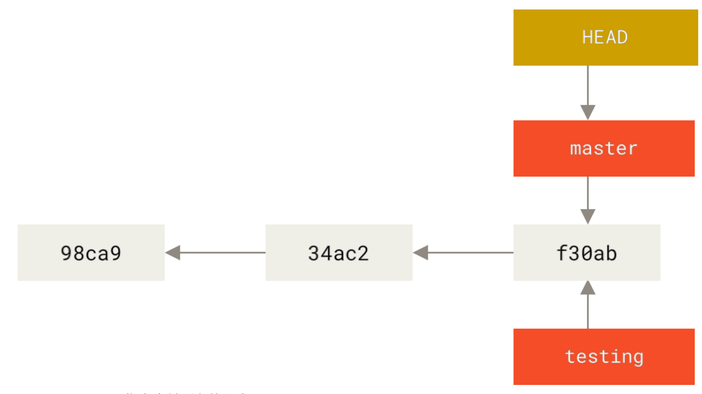
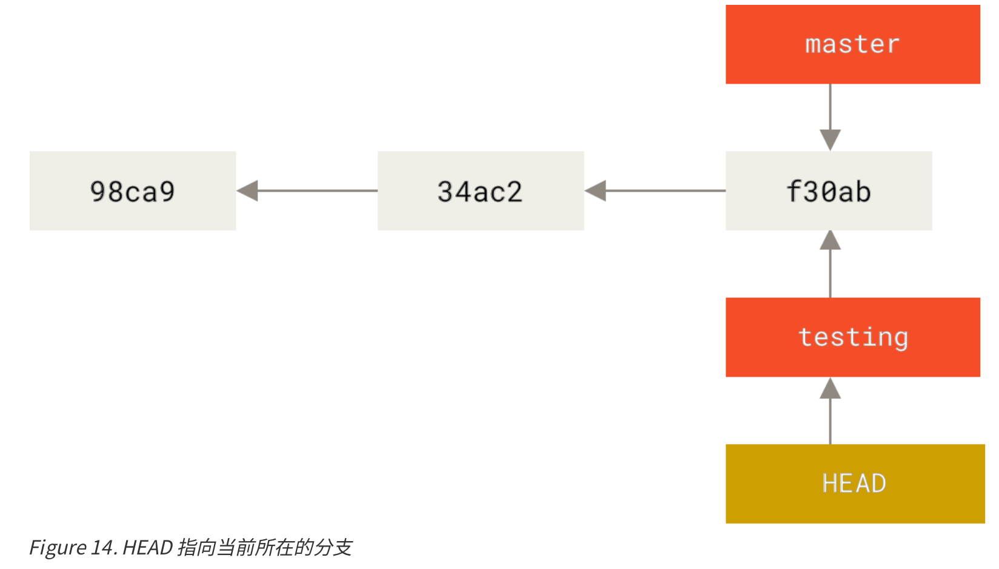
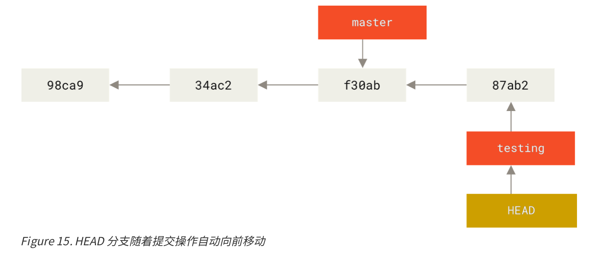
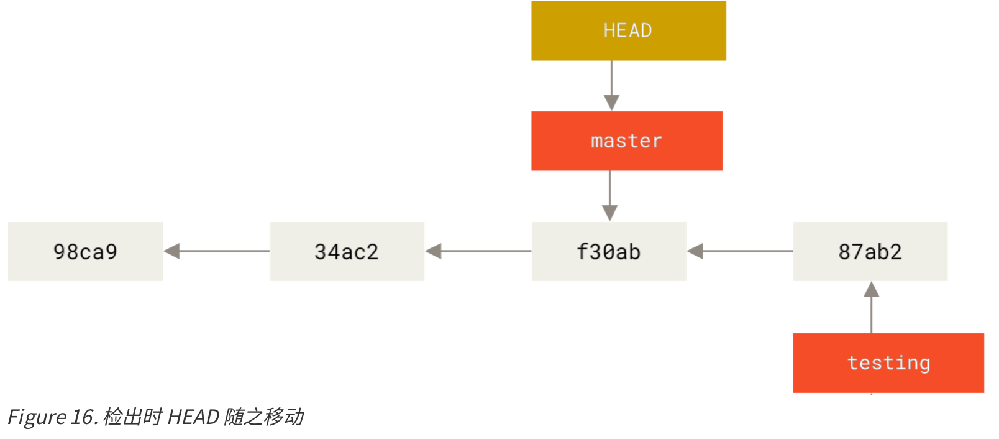
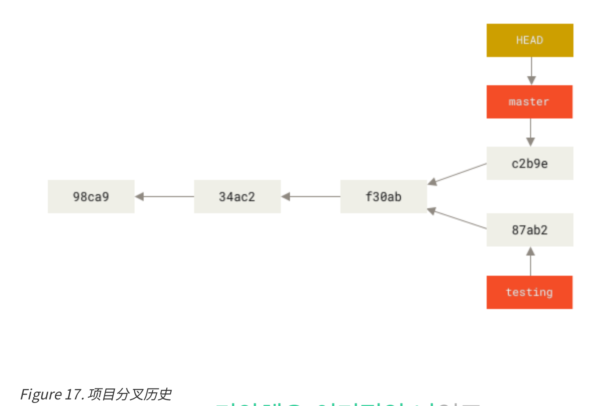
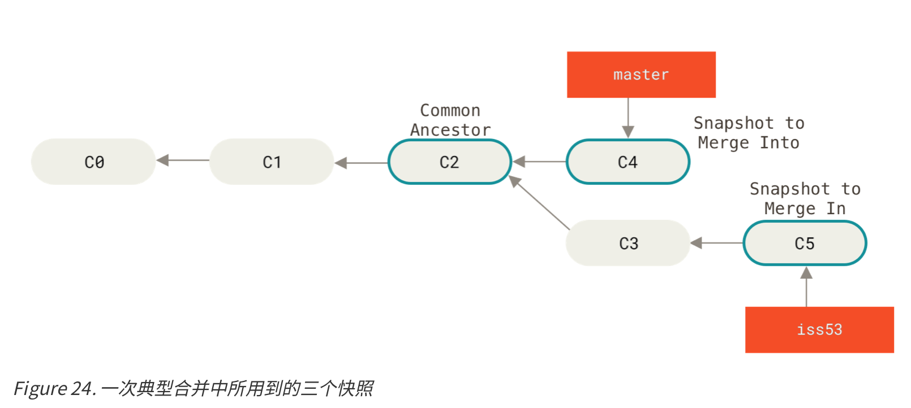
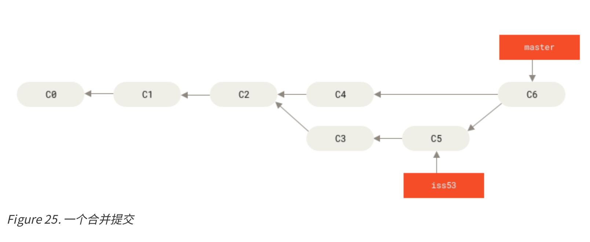

# 2 Git分支

## 分支介绍

**分支创建**

 - `git branch <branchName>`：创建分支
 - `HEAD`代表着当前的分支

```
$ git log --oneline --decorate
f30ab (HEAD -> master, testing) add feature #32
...
```
 - 正如你所见，当前 master 和 testing 分支均指向校验和以 f30ab 开头的提交对象。

**分支切换**

 - `git checkout testing`；将HEAD从master转移到testing分支




```
(Make changes)
git commit -a -m "made a change" # -a automatically add changes from all known files
```



```
git checkout master
```



```
(make changes)
git commit -a -m "other changes"
```



```
$ git log --oneline --decorate --graph --all
* c2b9e (HEAD, master) made other changes
| * 87ab2 (testing) made a change
|/
* f30ab add feature #32 - ability to add new formats to the
* 34ac2 fixed bug #1328 - stack overflow under certain conditions * 98ca9 initial commit of my project
```

 - 与过去大多数版本控制系统形成了鲜明的对比，它们在创建分支时，将所有的项目文件都复制一遍，并保存到一个特定的目录。而在 Git 中，任何规模的项目都能在瞬间创建新分支。 

**分支的合并**

 - 此时，如果我们把iss53合并到master
```
$ git checkout master
Switched to branch 'master'
$ git merge iss53
Merge made by the 'recursive' strategy. index.html | 1 +
1 file changed, 1 insertion(+)
```
 - 这次的merge有点不同（此次是**三方合并**)，因为master分支所在的提交并不是 iss53 分支所在的提交的直接祖先




**遇到冲突时的分支合并**

 - 有时候合并操作不会如此顺利.
 - 如果你在两个不同的分支中，对同一个文件的同一个部分进行了不同的修 改，Git 就没法干净的合并它们。

```
$ git merge iss53
Auto-merging index.html
CONFLICT (content): Merge conflict in index.html
Automatic merge failed; fix conflicts and then commit the result.
```

 - 此时，可以用`git status`来查看那些因包含合并冲突而处于未合并 (unmerged)状态。
 - 任何因包含合并冲突而有待解决的文件，都会以未合并状态标识出来。 
```
<<<<<<< HEAD:index.html
someChangeA
=======
someChangeB
>>>>>>> iss53:index.html
```

 - 把<< HEAD, ===, >> 都解决了，使用`git add`和`git commit`。
 - 可以使用`git log --graph`确认合并成功

## 分支管理

 - `git branch -v`：查看每一个分支的最后一次提交
 - `git branch [--merged | --no-merged]`：过滤分支列表中已经合并或尚未合并到当前分支的分支

 ## 分支开发工作流


