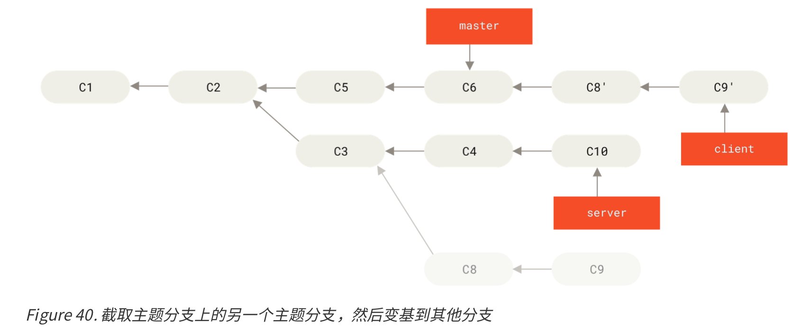
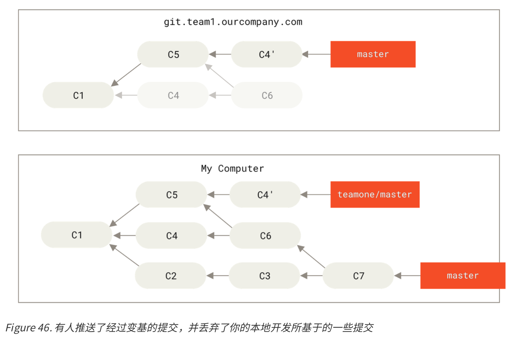

# 2 Git分支

## 分支介绍

**分支创建**

 - `git branch <branchName>`：创建分支
 - `HEAD`代表着当前的分支

```
$ git log --oneline --decorate
f30ab (HEAD -> master, testing) add feature #32
...
```
 - 正如你所见，当前 master 和 testing 分支均指向校验和以 f30ab 开头的提交对象。

**分支切换**

 - `git checkout testing`；将HEAD从master转移到testing分支


```
(Make changes)
git commit -a -m "made a change" # -a automatically add changes from all known files
```


```
git checkout master
```


```
(make changes)
git commit -a -m "other changes"
```


```
$ git log --oneline --decorate --graph --all
* c2b9e (HEAD, master) made other changes
| * 87ab2 (testing) made a change
|/
* f30ab add feature #32 - ability to add new formats to the
* 34ac2 fixed bug #1328 - stack overflow under certain conditions * 98ca9 initial commit of my project
```

 - 与过去大多数版本控制系统形成了鲜明的对比，它们在创建分支时，将所有的项目文件都复制一遍，并保存到一个特定的目录。而在 Git 中，任何规模的项目都能在瞬间创建新分支。 

**分支的合并**

 - 此时，如果我们把iss53合并到master
```
$ git checkout master
Switched to branch 'master'
$ git merge iss53
Merge made by the 'recursive' strategy. index.html | 1 +
1 file changed, 1 insertion(+)
```
 - 这次的merge有点不同（此次是**三方合并**)，因为master分支所在的提交并不是 iss53 分支所在的提交的直接祖先


**遇到冲突时的分支合并**

 - 有时候合并操作不会如此顺利.
 - 如果你在两个不同的分支中，对同一个文件的同一个部分进行了不同的修 改，Git 就没法干净的合并它们。

```
$ git merge iss53
Auto-merging index.html
CONFLICT (content): Merge conflict in index.html
Automatic merge failed; fix conflicts and then commit the result.
```

 - 此时，可以用`git status`来查看那些因包含合并冲突而处于未合并 (unmerged)状态。
 - 任何因包含合并冲突而有待解决的文件，都会以未合并状态标识出来。 
```
<<<<<<< HEAD:index.html
someChangeA
=======
someChangeB
>>>>>>> iss53:index.html
```

 - 把<< HEAD, ===, >> 都解决了，使用`git add`和`git commit`。
 - 可以使用`git log --graph`确认合并成功

## 分支管理

 - `git branch -v`：查看每一个分支的最后一次提交
 - `git branch [--merged | --no-merged]`：过滤分支列表中已经合并或尚未合并到当前分支的分支

## 分支开发工作流

**长期分支**

 - 可以使用Git维护同一个项目的不同版本（因此，不同稳定性的代码），比如：
   - master分支上保留**完全稳定**的代码
     - 可能是即将发布的代码
   - develop或者next的平行分支，被用来做**后续开发**或者**测试稳定性**
     - 这些分支不必保持绝对稳定
     - 一旦达到稳定状态，它们就可以被合并入 master 分支了


 - 你也可以想象成：


**主题分支**

 - 主题分支是一种短期分支
 - 它被用来实现单一特性或其相关工作
 - 一个例子：
   - 你在 master 分支上工作到 C1，这时为了解决一个问题而新建 iss91 分支，在 iss91 分支上工作到 C4，然而对于那个问题你又有了新的想法，于是你再新建一个 iss91v2 分支试图用另一种方法解决那个问题
   - 接着你回到master分支工作了一会儿，你又冒出了一个不太确定的想法，你便在C10的时候新建 一个 dumbidea 分支，并在上面做些实验。 
   - 你的提交历史看起来像下面这个样子:


   - 现在，我们假设两件事情:
    1. 你决定**使用第二个方案**来解决那个问题，即使用在**iss91v2**分支中方案。
       - 可以抛弃 iss91 分支(即丢弃 C5 和 C6 提交)
    2. 决定把dumbidea合并入master 

   - 最终你的提交历史看起来像下面这个样子:


## 远程分支
 - 从你的电脑的角度，远程仓库名字形式都是`<remote>/<branch>`
 - 当你运行`git init`时，默认分支名字为`master`
 - 当你运行`git clone`时，默认远程仓库名字为`origin`


 - 假设你在本地的`master`分支做了一些工作，同时间内有其他人推送提交到`git.ourcompany.com`并更新了它的`master`分支
 - 但是，只有你不链接到`origin`服务器，它的`origin/master`分支指针就不会移动


 - 可用`git fetch <remote>`与远程仓库同步数据（之后会更详细解释）


 - 可用`git remote add <name> <repo url>`添加一个新的远程仓库
   - 以下是`git remote add teamone <url>`的例子：


 - 现在，可用`git fetch <name>` (如`git fetch teamone`) 抓取`teamone`(而不是`master`)有而本地没有的数据（之后会更详细解释）


**推送**

 - 当你想要公开分享一个分支时，需要将其推送到**有写入权限的远程仓库**上。
 - 本地的分支**不会自动**与远程仓库**同步**
   - 这样，你可以把不愿意分享的内容放到*私人分支上*，而将需要和别人协作的内容推送到公开分支。
 - 推送到服务器上：`git push <remote> <branch>`
   - 背后的意思是：推送**本地的serverfix**分支来更新**远程仓库上的serverfix**分支。
   - 所以也可以用：`git push <remote> <本地分支>:<远程分支>`
     - 来将本地的某分支推送到远程仓库上的某分支。

 - 如果想要在自己的 serverfix 分支上工作，可以将其建立在远程跟踪分支之上: `git checkout -b serverfix origin/serverfix`

**跟踪分支**

 - 从一个远程跟踪分支检出(checkout)一个本地分支会自动创建所谓的“跟踪分支”
   - 它跟踪的分支叫做“上游分支”

 - 默认`git clone`时常会自动创建一个跟踪`origin/master`的`master`分支
   - 可用`git checkout --track origin/serverfix`跟踪其他分支
     - 如果尝试checkout的分支在本地不存在而在远程存在，可用`git checkout serverfix`
   - 可用`git checkout -b <branch> <remote>/<branch>`将本地分支与远程分支设置为不同的名字

 - 可用`git branch -u origin/serverfix`来修改正在跟踪的上游分支

**查看跟踪分支**

 - 可用`git branch -vv`查看设置的所有跟踪分支

```
$ git branch -vv
  iss53 7e424c3 [origin/iss53: ahead 2] forgot the brackets 
  master 1ae2a45 [origin/master] deploying index fix
  * serverfix f8674d9 [teamone/server-fix-good: ahead 3, behind 1] this should do it
  testing   5ea463a trying something new
```

 - 可看到iss53分支正在跟踪origin/iss53并且 “ahead” 是 2
   - 意味着**本地有两个提交还没有推送**到服务器上。 
 - 也能看到master分支正在跟踪 origin/master 分支并且是最新的。 
 - 也看到 serverfix 分支正在跟踪 teamone 服务器上的 server-fix-good 分支并且领先 3 落后 1
   - 意味着**服务器上有一次提交还没有合并**入同时**本地有三次提交还没有推送**。 
 - 最后看到 **testing 分支并没有跟踪任何远程分支**。

**注意：**
 - `git branch -vv`的资料来自于你从每个服务器上最后一次抓取的数据；可能不是最新的
 - 如果要最新的，执行`$ git fetch --all; git branch -vv`

**拉取**

 - `git fetch`：从服务器上抓取本地没有的数据时，它并不会修改工作目录中的内容
   - 只会获取数据然 后让你自己合并
   - 本地不会自动生成一份可编辑的副本(拷贝)。 

 - `git pull`：从服务器上抓取数据然后尝试合并入那个远程分支。 
   - 在大多数情况下，它的含义是`git fetch; git merge`
   
 - 建议使用`fetch + merge`；避免混乱

**删除远程分支**

 - `git push origin --delete <分支>`：从服务器上移除这个分支的指针
   - Git 服务器通常会保留数据一段时间直到垃圾回收运行，所以如果不小心删除掉了，通常是很容易恢复的。

## 变基(rebase)

 - 整合来自不同分支的修改主要有两种方法:merge以及rebase
   - 两种方法最终结果没差别，但**变基使得提交历史更加整洁**。 

### 简单例子


**Merge**


**Rebase**
 - 提取C4中的修改，在C3“重播”

```
$ git checkout experiment
$ git rebase master
First, rewinding head to replay your work on top of it... Applying: added staged command
```


```
$ git checkout master
$ git merge experiment
```


### 更有趣的例子

 - 假设：


 - 假设你希望将client中的修改合并到主分支并发布，但暂时并不想合并 server 中的修改， 
   - 可使用`git rebase --onto`：取出 client 分支，找出它从 server 分支分歧之后的补丁（即C8和C9）， 然后把这些补丁在 master 分支上重放一遍，让 client 看起来像直接基于 master 修改一样
   
```
$ git rebase --onto master server client
```



```
$ git checkout master
$ git merge client
```


 - 此时，我们想合并server和master。 两个方法：
   - 可使用`git rebase <topicbranch>` ，但记得要`git checkout`...
   - 可使用`git rebase <basebranch> <topicbranch>`直接将主题分支(topicbranch) (即本例中的 server)变基到目标分支(basebranch)(即 master)上。
     - 省去你先切换到 server 分支


```
$ git checkout master
$ git merge server
$ git branch -d client 
$ git branch -d server
```

### 变基的风险

 - 用变基就一定要守一条规则：`如果提交存在于你的仓库之外，而别人可能基于这些提交进行开发，那么不要执行变基。`
   - 变基其实就是丢弃一些现有的提交，然后相应地新建一些内容一样但实际上不同的提交。 
   - 如果你已经将提交推送至某个仓库，而其他人也已经从该仓库拉取提交并进行了后续工作，此时，如果你用`git rebase`重新整理了提交并再次推送，事情就变得很乱。

 - 假设以下：


 - 然后，某人又向中央服务器提交了一些修改，其中还包括一次合并。
 - 你也pull了


 - 接下来，这个人又决定把合并操作回滚，改用变基。
 - 之后你从服务器抓取更新，会发现多出来一些新的提交（即C4')



 - 现在你们两人的处境都十分尴尬。
 -  如果你执行`git pull`命令，你就把那些已经被变基抛弃的提交又找了回来（即C4和C6）。 
 - 整个历史就很混乱（不是一条线）


### 用变基解决变基

 - (不懂这部分)
 - `git pull --rebase`??

### 变基 vs. 合并

 - 有一种观点认为，仓库的**提交历史即是记录实际发生过什么**。 
   - 它是针对历史的文档，**本身就有价值，不能乱改**。 
 - 另一种观点则正好相反，他们认为**提交历史是项目过程中发生的事**。
   - 没人会出版一本书的第一版草稿。
   - 持这一观点的人会使用 rebase 及 filter-branch 等工具来编写故事

 - 总的原则是，只对尚未推送或分享给别人的本地修改执行变基操作清理历史， 从不对已推送至别处的提交执行 变基操作，这样，你才能享受到两种方式带来的便利。

